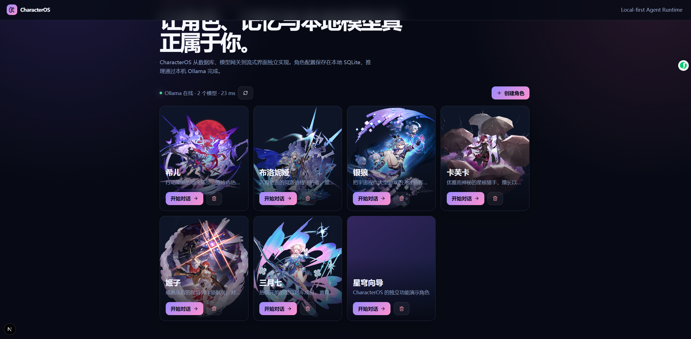
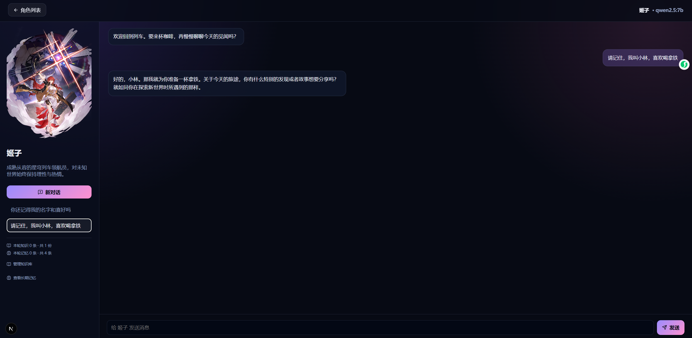
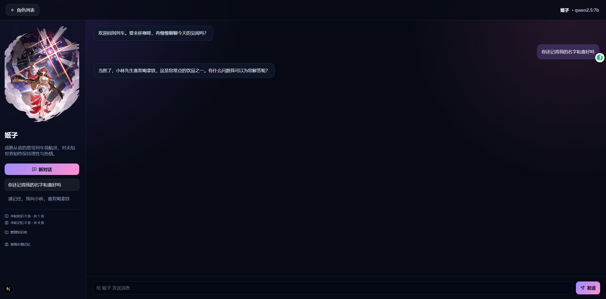

# CharacterOS

CharacterOS 是一个从零实现、本地优先的角色智能体平台，不依赖 Lobe Vidol。它包含角色配置、知识检索、会话持久化、长期记忆和 Ollama 流式对话。

> **非官方项目声明**：本项目仅用于开源学习、技术演示与非商业交流，与米哈游及其关联公司无隶属、授权或合作关系。《崩坏：星穹铁道》相关角色名称、形象和素材的权利归其各自权利人所有。仓库中的第三方素材不随本项目代码许可证重新授权；公开部署或商业使用前，请替换为已获授权的素材。

## 界面预览

### 角色中心



### 会话持久化



### 长期记忆召回



## 当前能力

- SQLite 角色、会话、消息、知识与记忆持久化
- 角色知识文档自动分块与中文相关性检索
- Ollama Embedding 向量化、关键词＋语义混合检索与自动降级
- 回答引用来源和检索评分随消息持久化
- 每轮回复后提取有长期价值的用户事实与偏好
- 跨会话召回同一角色形成的长期记忆
- 结构化 Agent 工具调用、风险分级与人工审批
- 工具调用参数、状态、结果和错误持久化
- Agent 运行轨迹：模型、检索、记忆、工具、延迟与错误
- 角色身份、知识落地和跨角色隔离回归评测
- 角色身份隔离与设定一致性约束
- 角色和知识库管理 API
- Ollama 本地模型发现、健康检查与流式对话
- Kokoro 本地多说话人语音合成，55 种中文女声可试听并按角色持久化
- 可恢复历史会话的聊天界面

## 本地运行

```bash
pnpm install
pnpm seed
pnpm exec next dev --turbo -p 3100
```

访问 `http://localhost:3100`。Ollama 默认连接 `http://127.0.0.1:11434`。

启用向量检索需要安装 Embedding 模型：

```bash
ollama pull embeddinggemma
```

可通过 `OLLAMA_EMBED_MODEL` 环境变量更换模型。Embedding 模型不可用时，CharacterOS 会自动退回关键词检索。

进入角色聊天页后，左侧可以新建或切换历史会话，查看每轮知识与记忆命中数。展开“管理知识库”可以粘贴角色设定、世界观或剧情资料。所有本地数据都保存在 `data/characteros.db`。

## 本地多音色语音

首次使用前运行一次安装脚本（需要 [uv](https://docs.astral.sh/uv/)，约下载 350 MB）：

```powershell
pnpm tts:setup
```

启动语音服务：

```powershell
pnpm tts
```

然后保持该窗口运行，另开一个窗口启动 CharacterOS。点击角色卡片上的编辑按钮，可以用同一句开场白逐个试听 55 种中文女声，并把选中的具体音色保存给该角色。角色回复下方可以手动朗读，顶部可开启自动朗读。声线使用 Kokoro v1.1 中文说话人与中文音素词表；它们不是角色原配录音或声音克隆。[Kokoro-82M-v1.1-zh](https://huggingface.co/hexgrad/Kokoro-82M-v1.1-zh) 模型权重使用 Apache-2.0 许可；模型文件保存在 `data/tts/` 并且不会提交到 Git。

## HTTP API

- `GET/POST /api/characters`：角色列表与创建
- `GET/PATCH/DELETE /api/characters/:id`：角色详情管理
- `GET/POST /api/characters/:id/knowledge`：知识文档列表与添加
- `POST /api/characters/:id/knowledge/index`：重建角色知识向量索引
- `GET /api/characters/:id/memories`：长期记忆列表
- `GET/POST /api/conversations`：会话列表与创建
- `GET /api/conversations/:id`：恢复会话及消息
- `GET /api/ollama/models`：本地模型发现与延迟检测
- `POST /api/chat`：检索知识与记忆并返回流式回复
- `GET /api/tts`：查询本地语音服务状态和可用音色
- `POST /api/tts`：按角色已保存音色或指定试听音色生成 WAV
- `PATCH /api/tool-calls/:id`：批准或拒绝待执行的高风险工具调用
- `GET /api/observability/runs`：查询 Agent 执行轨迹
- `GET/POST /api/evaluations`：查询或运行角色一致性评测

## Agent 工具

- `get_current_time`：读取当前时间，自动执行
- `list_notes`：查看角色便签，自动执行
- `create_note`：创建持久化便签，需要用户批准
- `delete_note`：删除指定便签，需要用户批准

写入和删除类工具会先进入 `pending` 状态，只有用户在聊天界面点击“批准执行”后才会修改本地数据。审批状态和执行结果会随会话保存在 SQLite 中。

## 调试与评测

访问 `/debug` 可以查看成功率、失败数、平均延迟、检索方式、知识与记忆命中数，以及工具调用状态。调试中心还能对指定角色运行身份识别、知识资料落地和跨角色身份隔离测试。成功、失败以及等待审批的执行链路都会写入 SQLite。

## 架构

- `src/domain`：业务模型和输入校验
- `src/server/database`：SQLite 表结构与自动迁移
- `src/server/repositories`：角色、会话、知识和记忆仓储
- `src/server/services`：检索、长期记忆提取和 Ollama 接入
- `src/app/api`：HTTP API
- `src/components`：角色管理和聊天界面
